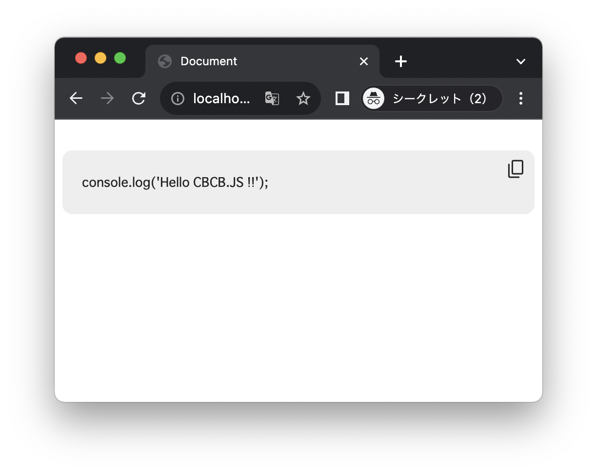

(c) 2023 Tomoya Onuki.

# CBCB.js
The JacaScript library that puts a **C**ode **B**lock **C**opy **B**utton for HTML.


## Usage
```
<head>
    <script src="cbcb.js?color=#222"></script>
    <link rel="stylesheet" href="cbcb.css">
</head>
```
- You can specify the button color by passing a color argument to the JS file.
- GoogleFont Material Symbols are used to display buttons. Links to GoogleFont CSS are automatically generated by JS.

## Example
#### HTML Code
```html
<!DOCTYPE html>
<html lang="en">
<head>
    <meta charset="UTF-8">
    <meta name="viewport" content="width=device-width, initial-scale=1.0">
    <title>Document</title>
    <script src="cbcb.js?color=#222"></script>
    <link rel="stylesheet" href="cbcb.css">
    <style>
        code {
            display: block;
            padding: 5px 20px;
            background-color: #eee;
            color: #222;
            border-radius: 10px;
        }
    </style>
</head>
<body>
    
    <pre>
        <code>
console.log('Hello CBCB.JS !!');
        </code>
    </pre>
</body>
</html>
```

#### Browser view
